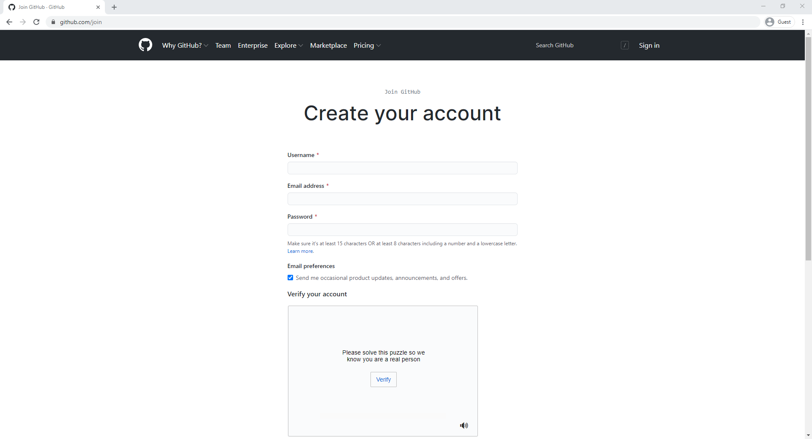
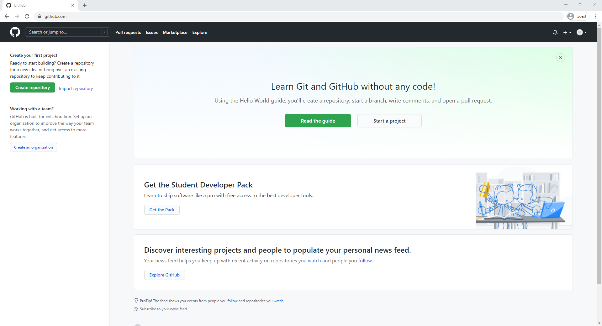
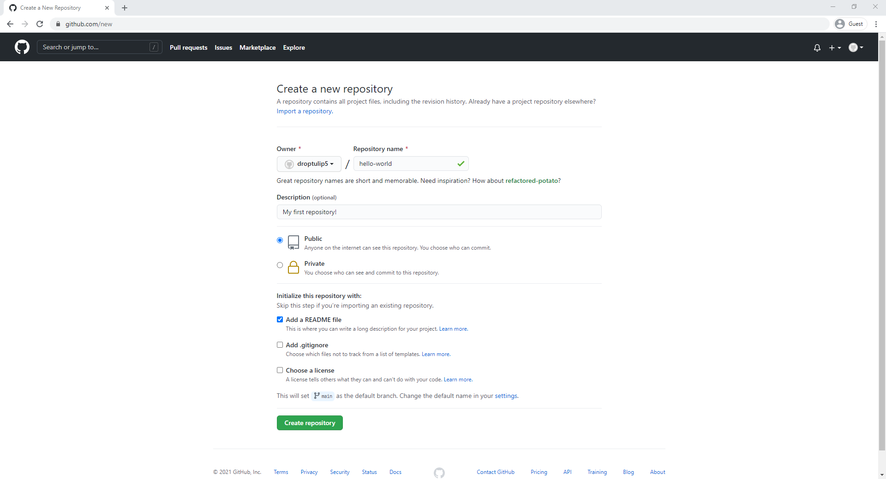
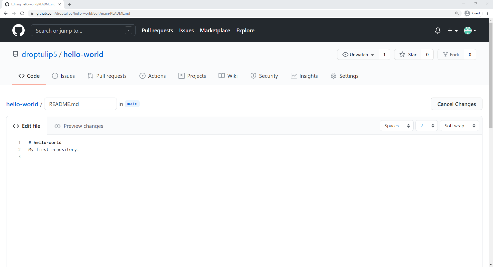
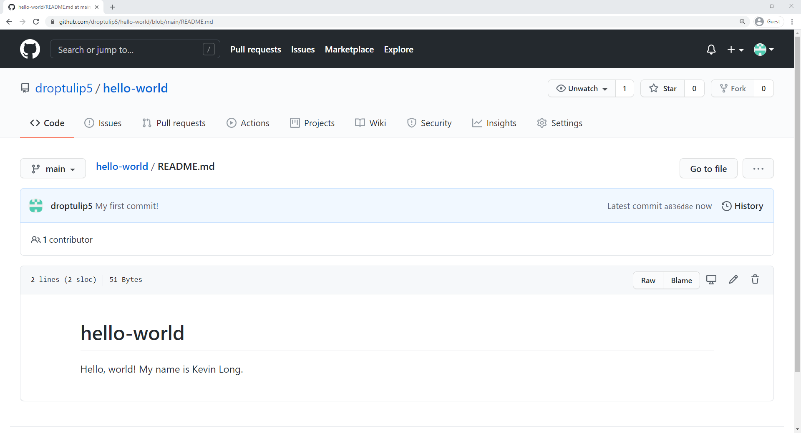

## Git and GitHub
---
Elder INTERalliance

=====

<!-- .slide: data-background="http://placekitten.com/1920/1080" -->
# Git vs GitHub

====

## Git

- A version control software
- Allows multiple people to work on the same project simultaneously
- Kind of like Google Docs for code

====

## GitHub

- A web interface for Git
- A place to host Git projects
- Adds some additional features on top of Git

=====

## Why should I care?

- Makes code collaboration easy <!-- .element: class="fragment" data-fragment-index="1" -->
- Makes managing code conflicts easy <!-- .element: class="fragment" data-fragment-index="2" -->

====
## GitHub Stats

56+ million
Developers

3+ million
Organizations

100+ million
Repositories

72%
Fortune 50

=====

## A quick intro

====

<!-- .slide: data-background-iframe="https://www.youtube-nocookie.com/embed/w3jLJU7DT5E?autoplay=1&cc_load_policy=3" -->

=====

## Join GitHub
 

    <a href="https://github.com/join" target="_blank">github.com/join</a>

====

=====

### Create our first repository!

====

### Fill out the detials

Make sure to check the box to Add a README file

=====

### Commits

- A reference to a point in history <!-- .element: class="fragment" data-fragment-index="1" -->
- Similar to saving a file <!-- .element: class="fragment" data-fragment-index="2" -->

=====

### Let's make a new commit!

====
Click the pencil icon to the right of README.md

====
It should now look like this:

====
Change your second line

====
Scroll to the bottom of the page and give your commit a message

====
Click commit

=====

### Congrats that's your first commit! 🎉

====

You should now see your name in your README

