## Git and GitHub
---
Elder INTERalliance

=====
# Git vs GitHub

====

## Git

- A version control software
- Allows multiple people to work on the same project simultaneously
- Kind of like Google Docs for code

====

## GitHub

- A web interface for Git
- A place to host Git projects
- Adds some additional features on top of Git

=====

## Why should I care?

- Makes code collaboration easy <!-- .element: class="fragment" data-fragment-index="1" -->
- Makes managing code conflicts easy <!-- .element: class="fragment" data-fragment-index="2" -->

====
## GitHub Stats

56+ million
Developers

3+ million
Organizations

100+ million
Repositories

72%
Fortune 50

=====

## A quick intro

====

<!-- .slide: data-background-iframe="https://www.youtube-nocookie.com/embed/w3jLJU7DT5E?autoplay=1&cc_load_policy=3" -->

=====

### Let's Review 

====

### What is GitHub?
1. Moisture data sharing. 💧 <!-- .element: class="fragment fade-out" data-fragment-index="1" -->
2. A tool for farmers. 👩‍🌾 <!-- .element: class="fragment fade-out" data-fragment-index="1" -->
3. Tractor cloning software. 🐑🐑 <!-- .element: class="fragment fade-out" data-fragment-index="1" -->
4. A collaborative platform for building software. 🔨

====

### What is Git?
1. Version control software. 🎮
2. A search engine. 🔍 <!-- .element: class="fragment fade-out" data-fragment-index="1" -->
3. A social network for farmers. 🕸 <!-- .element: class="fragment fade-out" data-fragment-index="1" -->
4. A programming language. 🐱‍💻 <!-- .element: class="fragment fade-out" data-fragment-index="1" -->

=====

## Join GitHub
<br/>

<span style="background: #212121; padding: 20px;">
    <a href="https://github.com/join" target="_blank">github.com/join</a>
</span>

====


=====

### Create your first repository!


====

### Fill out the detials

Make sure to check the box to Add a README file


=====

### Commits

- A reference to a point in history <!-- .element: class="fragment" data-fragment-index="1" -->
- Similar to saving a file <!-- .element: class="fragment" data-fragment-index="2" -->

=====

### Let's make a new commit!

====
Click the pencil icon to the right of README.md


====
It should now look like this:


====
Change your second line


====
Scroll to the bottom of the page and give your commit a message


====
Click commit


=====

### Congrats, that's your first commit! 🎉

====

You should now see your name in your README


=====

### Let's Review

====

### What is a commit?

1. A promise. 🔗 <!-- .element: class="fragment fade-out" data-fragment-index="1" -->
2. A reference to a point in history. 👆
3. A request to combine branches of code. 👩‍💻 <!-- .element: class="fragment fade-out" data-fragment-index="1" -->
4. A shooting star. 🌟 <!-- .element: class="fragment fade-out" data-fragment-index="1" -->

=====

## On to the next project!

=====

### Forks 🍴

- A personal copy of another user's repository <!-- .element: class="fragment" data-fragment-index="1" -->
- Allows you to directly edit <!-- .element: class="fragment" data-fragment-index="2" -->
- Not part of Git, but instead GitHub <!-- .element: class="fragment" data-fragment-index="3" -->

=====
## Slack Bio Bot
<br/>

<span style="background: #212121; padding: 20px;">
    <a href="https://git.io/Jqedr" target="_blank">git.io/Jqedr</a>
</span>

====

### It should look like this:
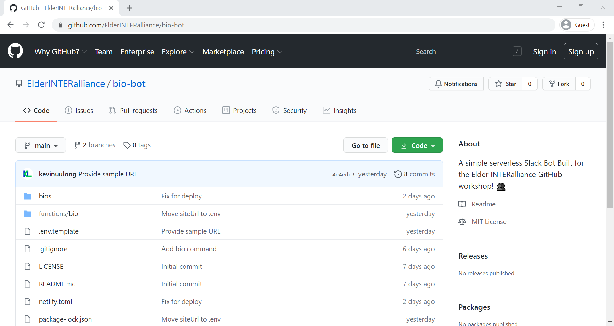

=====

### Create a fork
Look in the top right corner.


====

### It should look like this:
Note your username now shows up in the top left
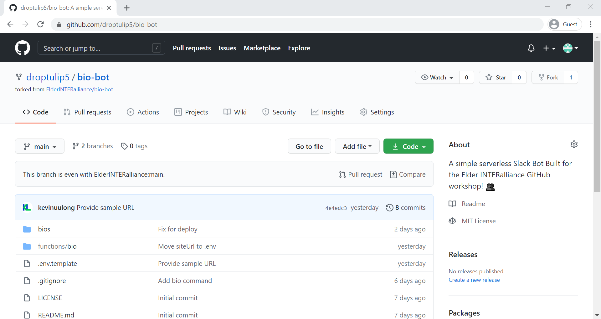

=====

You will be adding your bio to the Slack Bio Bot
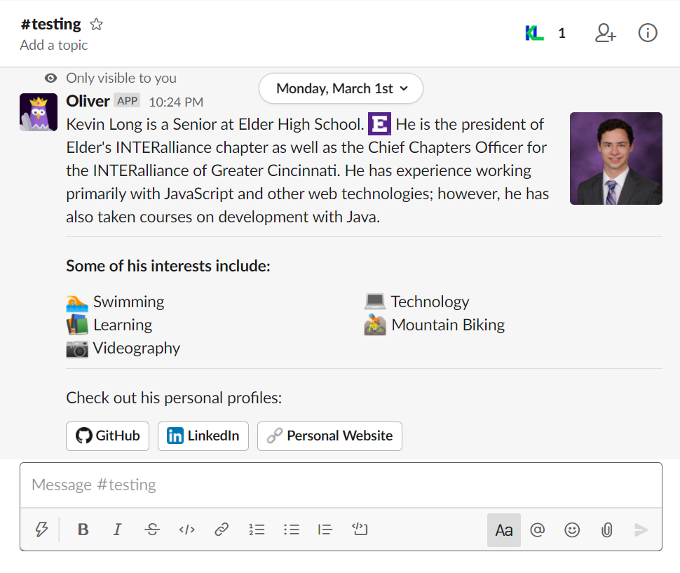

====

## You can customize this template:
<br/>

<span style="background: #212121; padding: 20px;">
    <a href="https://link.kevinuulong.com/JwZnt" target="_blank">link.kevinuulong.com/JwZnt</a>
</span>

====

### You may need to sign in
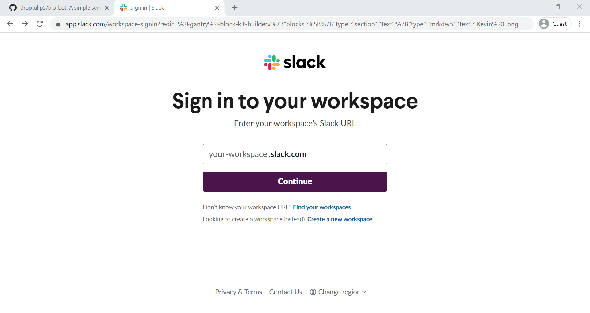

====

### Once you are signed in you should see something like this:
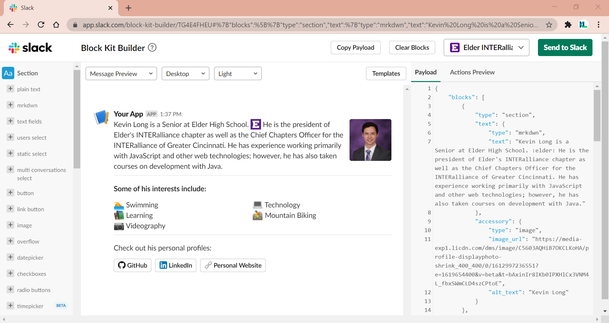

====

### You can edit the text in the `Payload` panel on the right


====

### Customize with your own information

```json [7|10-12|28-31|47-56|55]
{
	"blocks": [
		{
			"type": "section",
			"text": {
				"type": "mrkdwn",
				"text": "About You"
			},
			"accessory": {
				"type": "image",
				"image_url": "Image URL",
				"alt_text": "Image Description"
			}
		},
		{
			"type": "divider"
		},
		{
			"type": "section",
			"text": {
				"type": "mrkdwn",
				"text": "*Some of his interests include:*"
			}
		},
		{
			"type": "section",
			"fields": [
				{
					"type": "mrkdwn",
					"text": ":swimmer: Swimming"
				}
			]
		},
		{
			"type": "divider"
		},
		{
			"type": "section",
			"text": {
				"type": "mrkdwn",
				"text": "Check out his personal profiles:"
			}
		},
		{
			"type": "actions",
			"elements": [
				{
					"type": "button",
					"text": {
						"type": "plain_text",
						"text": ":github: GitHub",
						"emoji": true
					},
					"url": "https://github.com/kevinuulong",
					"action_id": "actionId-00"
				}
			]
		}
	]
}
```

====

Once you have filled it out click `Copy Payload` from the top ✂️
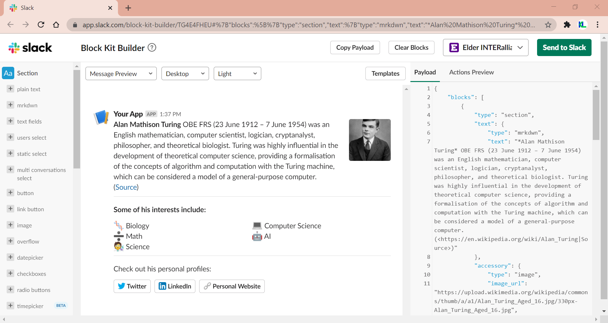

=====

## Back to GitHub 🔙

====

### Click on the `bios` directory
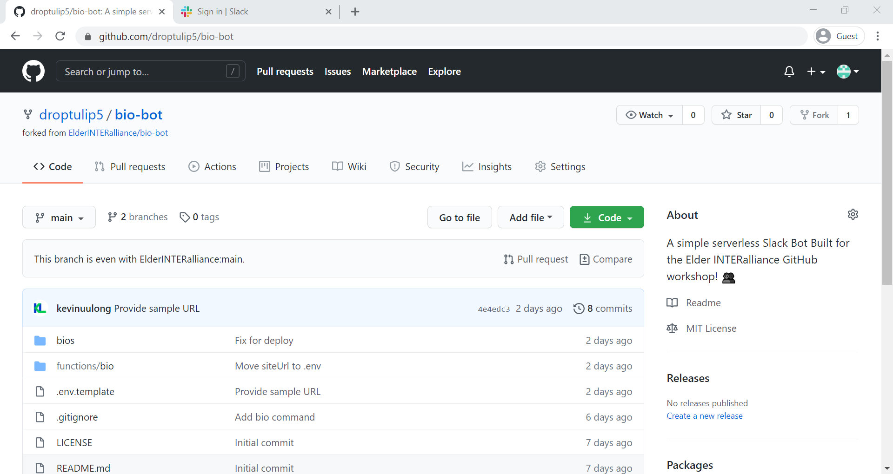

====

### Create a new file
Add file > Create new file
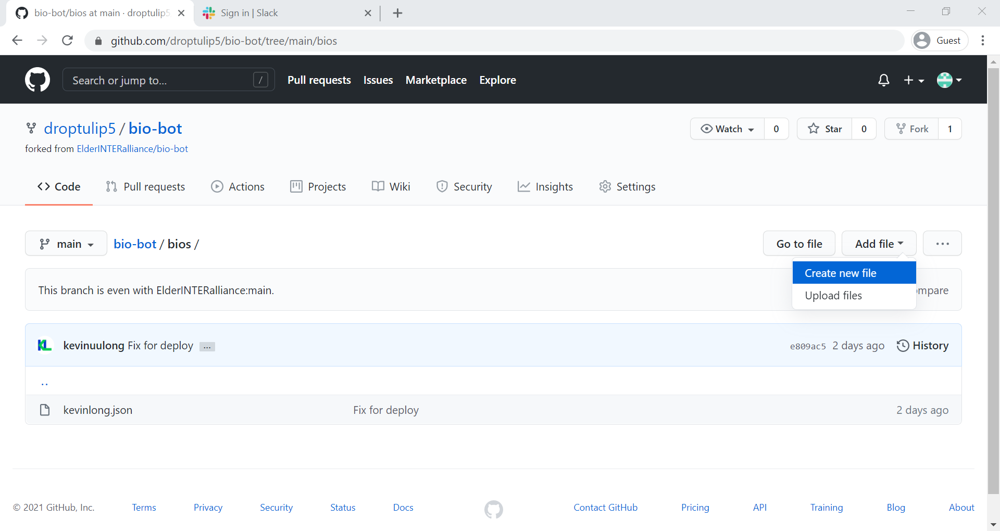

====

### Name your file
Use your name without spaces

⚠️ Make sure that it ends in `.json`
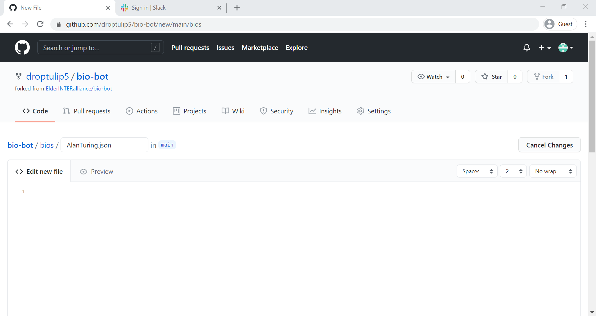

====

### Paste your bio 📋
If it isn't on your clipboard go back and copy it from Slack again
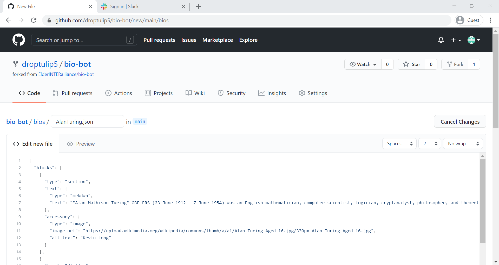

====

### Scroll down and commit
🔔 Don't forget a commit message!
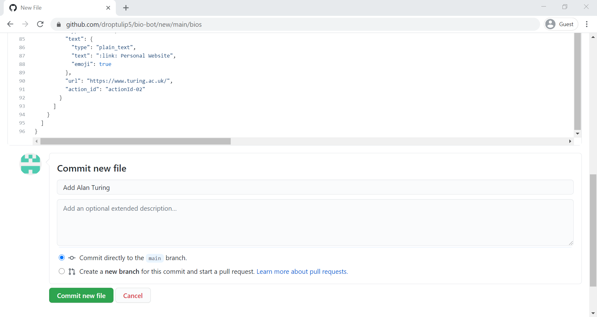

====

### You should now see your new commit
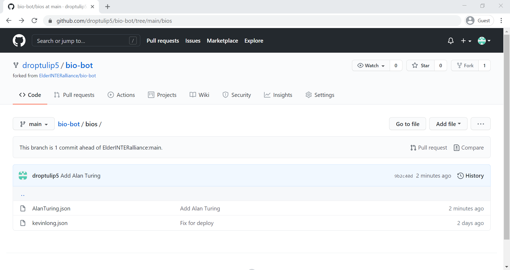

=====

## Some new terms!

====

### Merging 

- Applies changes from one branch or fork into another <!-- .element: class="fragment" data-fragment-index="1" -->
- Combines the commit history from the two into one <!-- .element: class="fragment" data-fragment-index="2" -->

====

### Pull Request

- A request to merge two branches or forks <!-- .element: class="fragment" data-fragment-index="1" -->
- Allows others to review your changes before going live <!-- .element: class="fragment" data-fragment-index="2" -->

=====

## Back to GitHub 🔙

====

### Creating a Pull Request
Click on Pull Request (on the right)


====

### Click on Create pull request
This screen allows you to choose the branches and repositories to merge
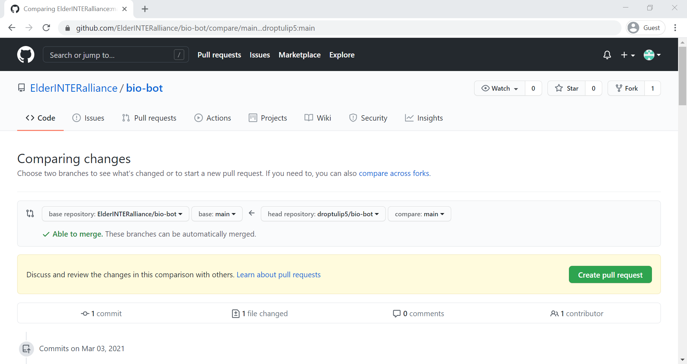

====

### Provide a Title and Description
The description should tell a reviewer anything they would need to know about your proposed changes
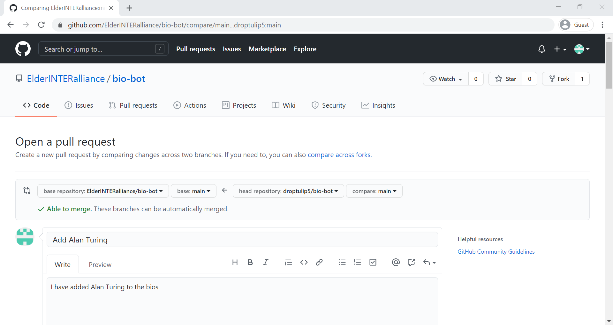

====

### Scroll down and Click Create pull request
📝You can also see the changes you are proposing
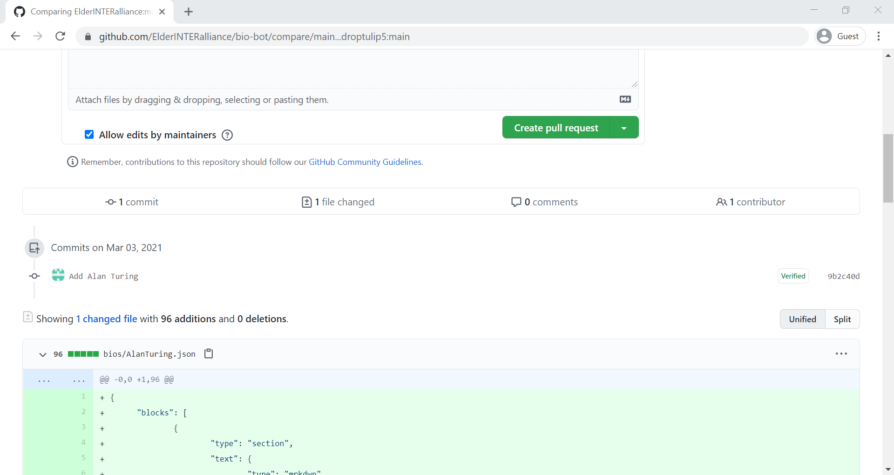

=====

### Congrats, that's your first pull request! 🥳

====

### Your pull request is now open for review!
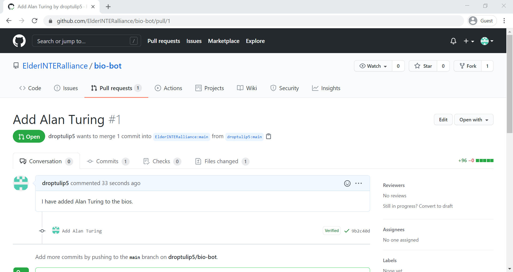

====

### If your pull request passes review it can then be merged
📝In this example this happens automatically; however, usually a mainainer will have to manually merge it
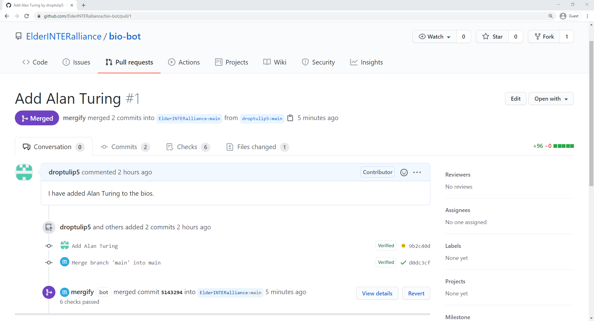

=====

### Let's Review 

====

### What is a fork?
1. A request to combine two branches. 🌿 <!-- .element: class="fragment fade-out" data-fragment-index="1" -->
2. An utensil. 🍴 <!-- .element: class="fragment fade-out" data-fragment-index="1" -->
3. A personal copy of a repository. ✂️
4. A combination of commit history. 🧔 <!-- .element: class="fragment fade-out" data-fragment-index="1" -->

====

### What is merging?
1. Combining changes from two separate branches into one. 1️⃣
2. A method of organizing your code. 🧹 <!-- .element: class="fragment fade-out" data-fragment-index="1" -->
3. What cars do when getting on the highway. 🚗 <!-- .element: class="fragment fade-out" data-fragment-index="1" -->
4. None of the above. ❌ <!-- .element: class="fragment fade-out" data-fragment-index="1" -->

====

### What is a pull request?
1. A request for a copy of the code. 👩‍💻 <!-- .element: class="fragment fade-out" data-fragment-index="1" -->
2. A request to combine two branches. 🌿
3. A reference to a point in history. 👆 <!-- .element: class="fragment fade-out" data-fragment-index="1" -->
4. A request to poll contributers. ✅ <!-- .element: class="fragment fade-out" data-fragment-index="1" -->

=====

### Time to Test!

====

### Open Slack
Try typing `/bio Your Name`
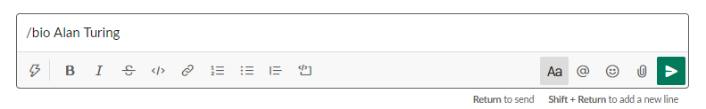

====

### Did it work?
If not, have someone else take a look at your commit.

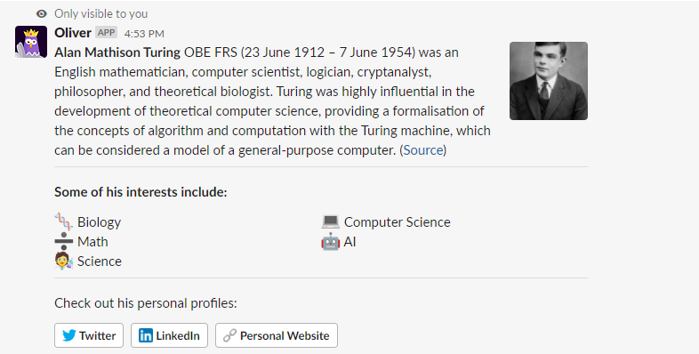

=====

<!-- .slide: data-background="https://media.giphy.com/media/xUPOqo6E1XvWXwlCyQ/giphy.gif" data-background-opacity="0.3"-->
### That's the Git and GitHub basics!

=====

### Extra Time? ⌚
Try a challenge!

====

1. Try opening an issue to ask for your pet to be added. (Make sure to include any details needed, bio, picture, etc.) 🐕
2. If you see an open issue, try resolving it! 🛠️
3. Check out <a href="https://learngitbranching.js.org/" target="_blank">learngitbranching.js.org</a> to learn how to use Git from the Command Line 🐱‍💻
