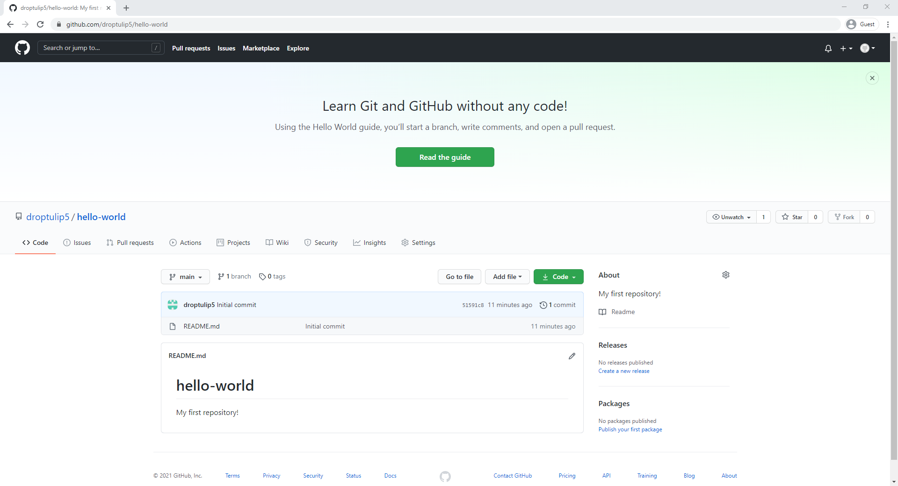
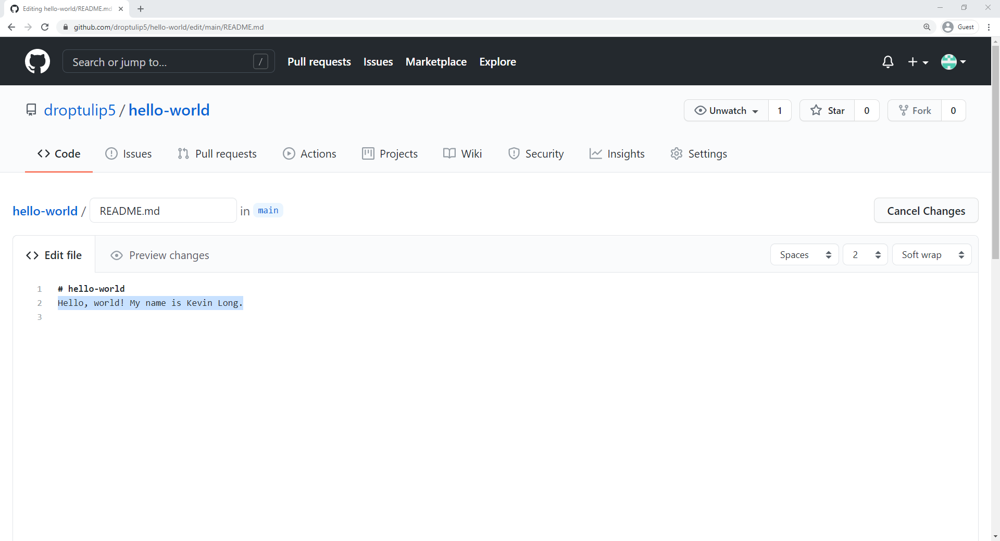

## Git and GitHub
---
Elder INTERalliance

=====

<!-- .slide: data-background="http://placekitten.com/1920/1080" -->
# Git vs GitHub

====

## Git

- A version control software
- Allows multiple people to work on the same project simultaneously
- Kind of like Google Docs for code

====

## GitHub

- A web interface for Git
- A place to host Git projects
- Adds some additional features on top of Git

=====

## Why should I care?

- Makes code collaboration easy <!-- .element: class="fragment" data-fragment-index="1" -->
- Makes managing code conflicts easy <!-- .element: class="fragment" data-fragment-index="2" -->

====
## GitHub Stats

56+ million
Developers

3+ million
Organizations

100+ million
Repositories

72%
Fortune 50

=====

## A quick intro

====

<!-- .slide: data-background-iframe="https://www.youtube-nocookie.com/embed/w3jLJU7DT5E?autoplay=1&cc_load_policy=3" -->

=====

## Join GitHub
<br/>

<span style="background: #212121; padding: 20px;">
    <a href="https://github.com/join" target="_blank">github.com/join</a>
</span>

====


=====

### Create our first repository!


====

### Fill out the detials

Make sure to check the box to Add a README file


=====

### Commits

- A reference to a point in history <!-- .element: class="fragment" data-fragment-index="1" -->
- Similar to saving a file <!-- .element: class="fragment" data-fragment-index="2" -->

=====

### Let's make a new commit!

====
Click the pencil icon to the right of README.md


====
It should now look like this:


====
Change your second line


====
Scroll to the bottom of the page and give your commit a message


====
Click commit


=====

### Congrats that's your first commit! 🎉

====

You should now see your name in your README


=====

### Review

====

### What is a commit?

1. A promise. 🔗
2. A reference to a point in history. 👆
3. A request to combine branches of code. 👩‍💻
4. A shooting star. 🌟

=====

## On to the next project!

=====

### Forks 🍴

- A personal copy of another user's repository <!-- .element: class="fragment" data-fragment-index="1" -->
- Allows you to directly edit <!-- .element: class="fragment" data-fragment-index="2" -->
- Not part of Git, but instead GitHub <!-- .element: class="fragment" data-fragment-index="3" -->

=====
## Slack Bio Bot
<br/>

<span style="background: #212121; padding: 20px;">
    <a href="https://git.io/Jqedr" target="_blank">git.io/Jqedr</a>
</span>

====

### It should look like this:


=====

### Create a fork
Look in the top right corner.


====

### It should look like this:
Note your username now shows up in the top left


=====

You will be adding your bio to the Slack Bio Bot


====

## You can customize this template:
<br/>

<span style="background: #212121; padding: 20px;">
    <a href="https://link.kevinuulong.com/JwZnt" target="_blank">link.kevinuulong.com/JwZnt</a>
</span>

====

### You may need to sign in


====

### Once you are signed in you should see something like this:


====

### You can edit the text in the "Payload" panel on the right


====

### Customize with your own information

```json [7|10-12|28-31|47-56|55]
{
	"blocks": [
		{
			"type": "section",
			"text": {
				"type": "mrkdwn",
				"text": "About You"
			},
			"accessory": {
				"type": "image",
				"image_url": "Image URL",
				"alt_text": "Image Description"
			}
		},
		{
			"type": "divider"
		},
		{
			"type": "section",
			"text": {
				"type": "mrkdwn",
				"text": "*Some of his interests include:*"
			}
		},
		{
			"type": "section",
			"fields": [
				{
					"type": "mrkdwn",
					"text": ":swimmer: Swimming"
				}
			]
		},
		{
			"type": "divider"
		},
		{
			"type": "section",
			"text": {
				"type": "mrkdwn",
				"text": "Check out his personal profiles:"
			}
		},
		{
			"type": "actions",
			"elements": [
				{
					"type": "button",
					"text": {
						"type": "plain_text",
						"text": ":github: GitHub",
						"emoji": true
					},
					"url": "https://github.com/kevinuulong",
					"action_id": "actionId-00"
				}
			]
		}
	]
}
```

====

Once you have filled it out click "Copy Payload" from the top
